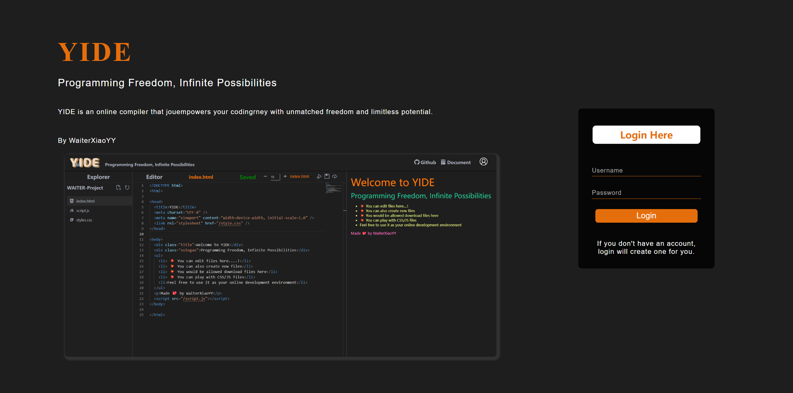
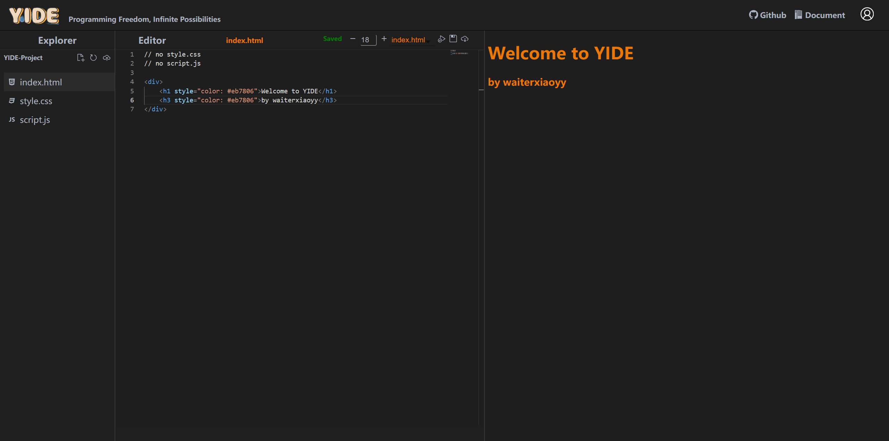

<div align="center">
<a href="https://sm.ms/image/iesNtO9GdnMvRXh" target="_blank"></a>

<h1 align="center">YIDE</h1>

:point_right: 一款轻量型的在线前端编译器:cupid: :point_left:

<h4>V 1.0</h4>

直达：[在线地址](http://xiaorongshu.cc)

文档持续完善中......

<!-- [](https://marketplace.visualstudio.com/items?itemName=codellms.codellms-ai)
[](https://marketplace.visualstudio.com/items?itemName=codellms.codellms-ai)
[](https://github.com/waiterxiaoyy/CodeLLMs-AI/blob/main/LICENSE) -->

</div>

## 介绍 :star2:




- YIDE是一款支持在线编写前端代码的编辑器，自己搭建后端编译，支持html、js、css和markdown编译，非常适合尝试一些想法，执行一些基础操作。

- 开发的初衷主要是两点：
    - 一是经常问GPT写一些样式，但是不能及时查看到效果，干脆直接手撸一个自己的在线查看器，后面做着做着完善了一些功能
    - 二是增加一下自己的项目经历


## 特点 :boom:

- :sunny: **文件管理**：z支持区分用户和文件存储，目前仅支持新文件创建，相比于其他在线平台，支持选择编译的主文件如html和md文件。

- :cat: **高亮代码**：集成进来的Monaco-Editor，支持文件语言识别，代码补全以及高亮，支持一系列快捷键，如一键保存编译和格式化代码。

- :penguin: **窗口拖动**：主要页面布局是文件区Explorer，编辑器Editor和展示区Viewer，支持各栏“自由”拖动。

- :panda_face: **多类型文件编译**：支持Html结合样式文件和脚本文件，支持Markdown格式文件编译。

- :monkey: **自由化**：编写Html文件支持自动引入默认的脚本文件和样式文件，也可自定义脚本文件和样式文件，具体查看使用文档。

- :dog: **内置图床**：Markdwon支持图像上传，内置OSS图床。

## 使用文档:iphone:

- **创建新文件**

在主页的左侧文件索引区Explorer创建新建文件，支持html，css，js，md为后缀的文件，其中html和md是可编译执行的文件。

**默认文件：index.html，script.js，style.css 是默认文件，默认文件不允许删除。**

**自行创建的文件名不建议包含style和script字眼。**

- **编辑文件**

在主页的中间区域是文件编辑区Editor，中间展示的当前文件名，可调节编辑区内的字体大小，选择编译文件（html/md），点击`编译按钮`则会自动保存所有未保存的文件然后编译，点击`保存按钮`会保存当前文件。

1.  Html编辑

html文件不需要标准模板，只需要书写主要结构即可

```html
<div>
    <h1 style="color: #eb7806">Welcome to YIDE</h1>
    <h3 style="color: #eb7806">by waiterxiaoyy</h3>
</div>
```

2. Css编辑

css编辑如下

```css
body {
    color: #e56e0c;
    margin: 0;
    padding: 0;
    background-color: #f4f4f4;
}
```

3. Js编辑

Js编辑如下

```js
document.addEventListener('DOMContentLoaded', function () { 
    console.log('JavaScript loaded for YIDE'); 
});
```

4. Md编辑

Md文件编辑支持常规的基础操作，暂不支持复杂的样式如类图、流程图。

- **文件编译**

文件编译目前仅支持html和md文件编译，后续集成查看TODO List。

1. Html编译

html会由后台自动解析出合格的代码，同时会解析style.css和script.js中的代码，由后台组合成一套完整的页面代码返回前台展示。

如果需要自定义样式文件和脚本文件，需要在html文件中加入下面两行：

```html
// no style.css
// no script.js
```

这两行代码需要严格按照上述格式写在需要自定义的html文件中，后台会识别并且取消加入默认的样式和脚本文件，用户自定义文件引入如下：

```html
// no style.css
// no script.js

<!-- 引入样式文件 -->
<link rel="stylesheet" href="/my.css" />

<!-- 引入脚本文件 -->
<script type="text/script" src="/my.js" ></script>

<div>
    <h1 style="color: #eb7806">Welcome to YIDE</h1>
    <h3 style="color: #eb7806">by waiterxiaoyy</h3>
</div>
```

当然，如果不需要引入文件，也可以直接在html文件的`<style></style>`和`<script></script>`中书写样式和脚本操作。

2. Md编译

Md编译结合的是掘金论坛主题，暂时不支持更换主题。

- **下载文件**

在文件索引区和编辑区都支持下载文件，点击`下载按钮`即可。


## TODO List 📅

- [ ] 页面布局优化：索引区缩进、响应式适配
- [ ] 文件上传功能
- [ ] 支持更多文件类型编译：vue、react等
- [ ] 集成控制台

## 贡献者 🤝

这个项目的存在感谢所有贡献者：:

<a href="https://github.com/waiterxiaoyy/YIDE/graphs/contributors">
  
</a>
